<p align="center">
  
</p>

<p align="center">
  <a href="https://www.linkedin.com/in/farukomerballi"></a>
  
</p>

<br/>

<p align="center">
  <em>“Kod yazmak bir araç; asıl iş, parçaların birbirine nasıl oturacağını görmek.”</em>
</p>

<br/>

## ◆ &nbsp;Mimar Defteri

```yaml
name: Faruk Ömer Ballı
title: "Mühendis değilim :) — çözüm mimarı ruhlu bir builder"
mindset:
  - Önce resmin tamamını çiz, sonra tuğlaları diz
  - Elle iki kez yapılan iş, üçüncüsünde otomasyona girer
  - Çalışan sistem güzeldir; sade çalışan sistem daha güzeldir
builds:
  platform:  [Kubernetes, OpenShift, WebLogic]
  data:      [Kafka, OpenSearch, Apache Iceberg, Nessie, Apache Doris]
  delivery:  [Jenkins, ArgoCD, GitOps]
  security:  [Wazuh SIEM]
side_quests:
  - Unity ile ilk mobil oyun 🎮
currently: "Bir sonraki sistemin taslağını çiziyor"
```

<br/>

## ◆ &nbsp;Katmanlar

<table align="center">
  <tr>
    <td align="right"><sub><b>PLATFORM</b></sub></td>
    <td></td>
  </tr>
  <tr>
    <td align="right"><sub><b>DATA &amp; STREAM</b></sub></td>
    <td></td>
  </tr>
  <tr>
    <td align="right"><sub><b>DELIVERY</b></sub></td>
    <td></td>
  </tr>
  <tr>
    <td align="right"><sub><b>OBSERVE</b></sub></td>
    <td></td>
  </tr>
  <tr>
    <td align="right"><sub><b>CRAFT</b></sub></td>
    <td></td>
  </tr>
</table>

<br/>

## ◆ &nbsp;Şantiye Raporu

<p align="center">
  
  
</p>

<p align="center">
  
</p>

<br/>

<p align="center">
  
</p>
